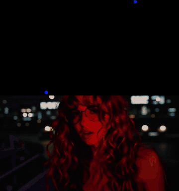
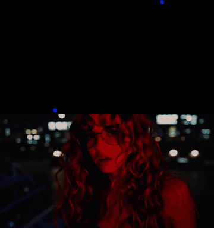
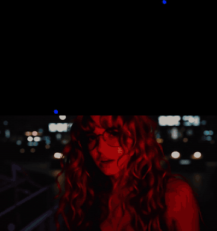
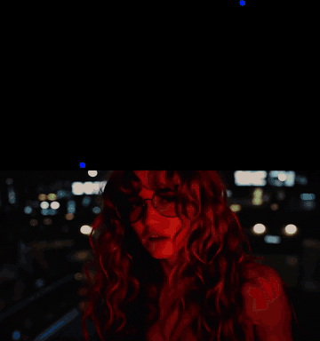
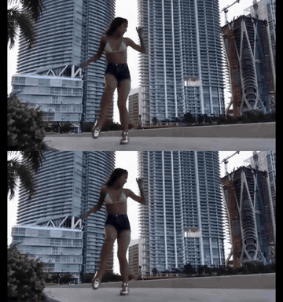
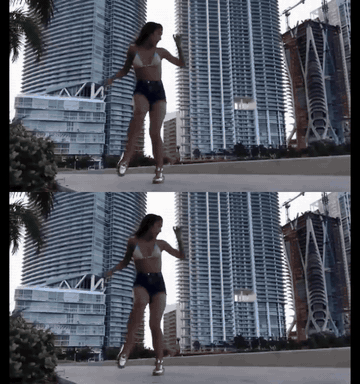

# LTX Director Motion Brush

Nightly ComfyUI node pack for LTX 2.3 timeline generation, per-image motion brush control, retake workflows, and motion-carry transitions.

**日本語ガイドあり**: [README_ja.md](./README_ja.md) | **Japanese guide included**

This is not just LTX Director with motion tracking tacked on. It is a rebuilt Motion Brush edition of LTX Director v2 with custom guide nodes, safer workflow helpers, standalone upload routes, retake preview output, motion-carry controls, and a polished release workflow for LTX 2.3 IC-LoRA motion-track control.

The original LTX Director v2 concept and base implementation are by WhatDreamsCost. This fork keeps that foundation and adds the Motion Brush workflow layer by exportAnything.

## What This Adds

- A Motion Brush timeline mode for drawing per-image motion tracks directly on top of storyboard images.
- A rebuilt Director node that keeps LTX Director v2 timeline behavior while adding Motion Brush controls, matte clips, per-image strength, and motion carry.
- A sparse-track guide renderer that turns drawn tracks into LTX 2.3 IC-LoRA motion-control video.
- A guide-attention balancing node that helps keep the final video from becoming either static or overpowered by visible motion-track dots.
- A retake source preview node that outputs the uploaded retake video for before/after comparison workflows.
- Motion Brush-safe crop/downscale helper nodes so the provided workflow can load without requiring users to install the upstream LTX Director package.
- Standalone `exportanything_ltx_director_*` upload/audio/workspace routes, avoiding route collisions with upstream LTX Director v2.
- New upload storage under `ComfyUI/input/exportanything`, with fallback support for older `ComfyUI/input/whatdreamscost` media paths.
- Guardrails for common failure modes, including Motion Brush aspect-ratio locking, retake minimum length, and anti-bleed default motion boundaries.

## Nightly Status

Nightly means this is the fast-moving preview channel. It is meant for users who are comfortable testing new ComfyUI nodes, reading notes, and reporting workflow-level issues.

The first release target is a GitHub prerelease tag named like:

```text
nightly-YYYYMMDD
```

## Install

Install through ComfyUI-Manager once the Registry version is available, or clone this repo into your ComfyUI `custom_nodes` folder:

```powershell
comfy node install ltx-director-motion-brush
```

```powershell
cd C:\ComfyUI\app\custom_nodes
git clone https://github.com/exportAnything/ComfyUI-LTX-Director-Motion-Brush.git
```

Restart ComfyUI after installing or updating.

This package can coexist with the upstream WhatDreamsCost LTX Director v2 package because Motion Brush uses unique node names and unique upload routes.

## Included Nodes

The public workflow depends on these rebuilt and Motion Brush-specific nodes:

- `LTXDirectorMotionBrushV2` - the main rebuilt timeline editor with Motion Brush mode, retake support, matte clips, per-image strength, and motion carry.
- `LTXDirectorMotionBrushV2Guide` - renders drawn motion tracks into a sparse-track control video for LTX 2.3 IC-LoRA workflows.
- `LTXDirectorMotionBrushV2GuideAttention` - balances Director image guidance against motion-track IC-LoRA guidance.
- `LTXDirectorMotionBrushV2RetakeSourcePreview` - exposes the uploaded retake source video so it can be compared against the generated output.
- `LTXDirectorMotionBrushV2SafeDownscaleFactor` - keeps latent downscale settings safe for stage workflows.
- `LTXDirectorMotionBrushV2DirectorGuide` - Motion Brush package version of the Director guide helper used by the workflow.
- `LTXDirectorMotionBrushV2CropGuides` - Motion Brush package version of the crop-guide helper used by the workflow.

Existing node class names are kept stable so saved workflows continue to load.

## Required Custom Nodes

Install or update these separately:

- `ComfyUI-LTXVideo`
- `comfyui-kjnodes`
- `ComfyUI-Impact-Pack`

For the GGUF low-VRAM workflow, also install:

- `ComfyUI-GGUF`

The example workflow also uses ComfyUI core video nodes and grouped/subgraph nodes saved inside the workflow.

## Required Models

The workflow expects an LTX 2.3 setup compatible with your local ComfyUI install. Typical required assets include:

- LTX 2.3 model/checkpoint or UNet setup used by your workflow.
- LTX 2.3 text encoders.
- LTX 2.3 VAE or tiny VAE used by the workflow.
- LTX 2.3 latent upscale model used by the workflow.
- Lightricks IC-LoRA Ingredients for LTX 2.3: https://huggingface.co/Lightricks/LTX-2.3-22b-IC-LoRA-Ingredients
- Lightricks IC-LoRA Motion-Track-Control for LTX 2.3, including the motion-track-control LoRA such as `ltx-2.3-22b-ic-lora-motion-track-control-ref0.5.safetensors`: https://huggingface.co/Lightricks/LTX-2.3-22b-IC-LoRA-Motion-Track-Control

Model paths are not bundled. Place models where your LTXVideo workflow expects them.

## Example Workflows

Recommended lower-VRAM workflow:

```text
example_workflows/LTX_Director_Motion_Brush_V2_Low_Vram.json
```

Very low-VRAM GGUF workflow:

```text
example_workflows/LTX_Director_Motion_Brush_V2_Low_Vram_GGUF.json
```

The GGUF workflow uses GGUF UNet/CLIP loaders and requires `ComfyUI-GGUF` plus matching GGUF model files.

Full/default workflow:

```text
example_workflows/LTX_Director_Motion_Brush_V2.json
```

Japanese annotated copy:

```text
example_workflows/LTX_Director_Motion_Brush_V2_ja.json
```

The Japanese copy keeps the same node behavior and class names, with translated workflow notes and selected workflow titles for easier onboarding.

The base public template is sanitized for release:

- no local user paths,
- no bundled source media,
- no saved retake video sample,
- package IDs updated to `ltx-director-motion-brush`.

The low-VRAM workflows may include example timeline references under `ComfyUI/input/exportanything`; replace missing images or audio with your own media after loading.

## Sample Outputs

These are generated examples from the included workflow and related Motion Brush settings. Click any preview to open the full MP4. GitHub may not preview MP4 blob pages directly, so lightweight GIF previews are included for the README.

<table>
  <tr>
    <td width="50%">
      <a href="Samples/MOTION_BRUSH.mp4"></a>
      <br>
      <strong>Motion Brush</strong><br>
      Core image timeline plus Motion Brush track guidance. Full video: <a href="Samples/MOTION_BRUSH.mp4">MOTION_BRUSH.mp4</a>.
    </td>
    <td width="50%">
      <a href="Samples/MOTION_BRUSH_DISTILLED_MODEL.mp4"></a>
      <br>
      <strong>Motion Brush Distilled</strong><br>
      Motion Brush behavior with the distilled model setup. Full video: <a href="Samples/MOTION_BRUSH_DISTILLED_MODEL.mp4">MOTION_BRUSH_DISTILLED_MODEL.mp4</a>.
    </td>
  </tr>
  <tr>
    <td width="50%">
      <a href="Samples/MOTION_CARRY_16_Frames.mp4"></a>
      <br>
      <strong>Motion Carry 16 Frames</strong><br>
      Intentional motion carry into the next image over 16 frames. Full video: <a href="Samples/MOTION_CARRY_16_Frames.mp4">MOTION_CARRY_16_Frames.mp4</a>.
    </td>
    <td width="50%">
      <a href="Samples/MOTION_CARRY_32_Frames.mp4"></a>
      <br>
      <strong>Motion Carry 32 Frames</strong><br>
      Stronger motion carry over 32 frames for more aggressive transitions. Full video: <a href="Samples/MOTION_CARRY_32_Frames.mp4">MOTION_CARRY_32_Frames.mp4</a>.
    </td>
  </tr>
  <tr>
    <td width="50%">
      <a href="Samples/RETAKE_8_Steps.mp4"></a>
      <br>
      <strong>Retake 8 Steps</strong><br>
      Retake Mode using a short sampling setup. Full video: <a href="Samples/RETAKE_8_Steps.mp4">RETAKE_8_Steps.mp4</a>.
    </td>
    <td width="50%">
      <a href="Samples/RETAKE_DISTILLED_MODEL.mp4"></a>
      <br>
      <strong>Retake Distilled</strong><br>
      Retake Mode behavior with the distilled model setup. Full video: <a href="Samples/RETAKE_DISTILLED_MODEL.mp4">RETAKE_DISTILLED_MODEL.mp4</a>.
    </td>
  </tr>
</table>

## Motion Brush Notes

- Turn on `Motion Brush` before editing motion tracks.
- `resize_method` is locked to `maintain aspect ratio` while Motion Brush is active.
- `Guide Strength` on the timeline image affects how strongly that image is held.
- `Carry Motion` defaults to `0` for anti-bleed behavior.
- Intentional carry values can push one image's motion into the next image for transition effects.
- Retake Mode enforces a 6 second minimum selection.

## Upload Storage

New timeline uploads are stored under:

```text
ComfyUI/input/exportanything
```

Legacy workflows that reference `ComfyUI/input/whatdreamscost` media are still readable as a compatibility fallback.

## Verification

These development checks are available from a source checkout of this repository. They are intentionally excluded from the Comfy Registry install archive so the installed node pack contains only runtime files.

From this repo folder, run:

```powershell
C:\ComfyUI\.venv\Scripts\python.exe .\tools\verify_phase3_local.py
```

For a running ComfyUI server, add:

```powershell
C:\ComfyUI\.venv\Scripts\python.exe .\tools\verify_phase3_local.py --base-url http://127.0.0.1:8188
```

The local check covers motion payload guardrails, node registration, Python compile, frontend syntax, `pip check`, and whitespace errors.

## Credits

Original LTX Director v2 concept and implementation by WhatDreamsCost:

```text
https://github.com/WhatDreamsCost/WhatDreamsCost-ComfyUI
```

Motion Brush packaging and LTX 2.3 motion-track integration by exportAnything.

See `ATTRIBUTION.md` for details.
